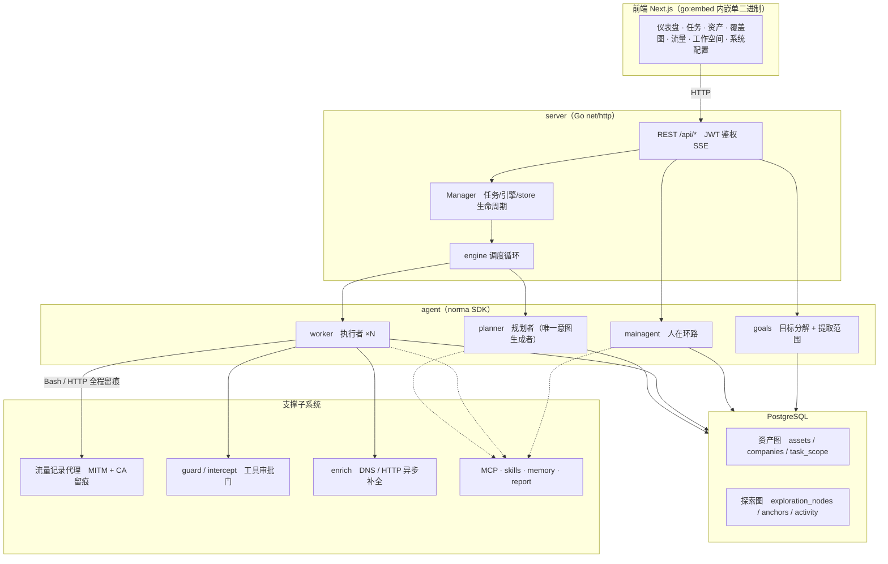
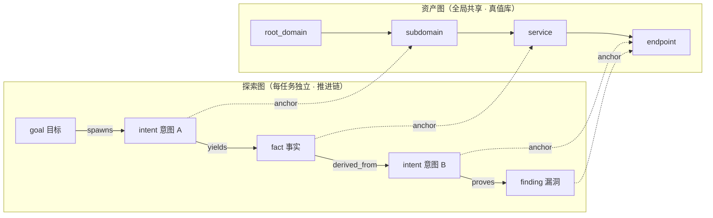
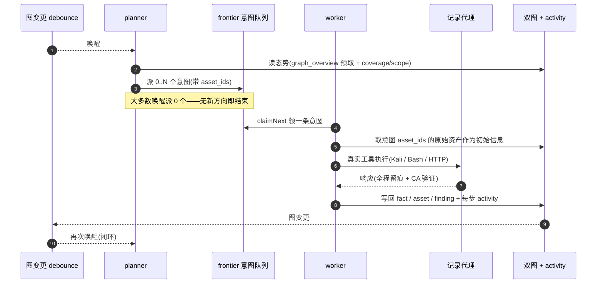
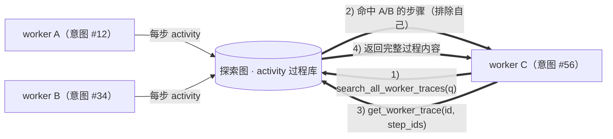
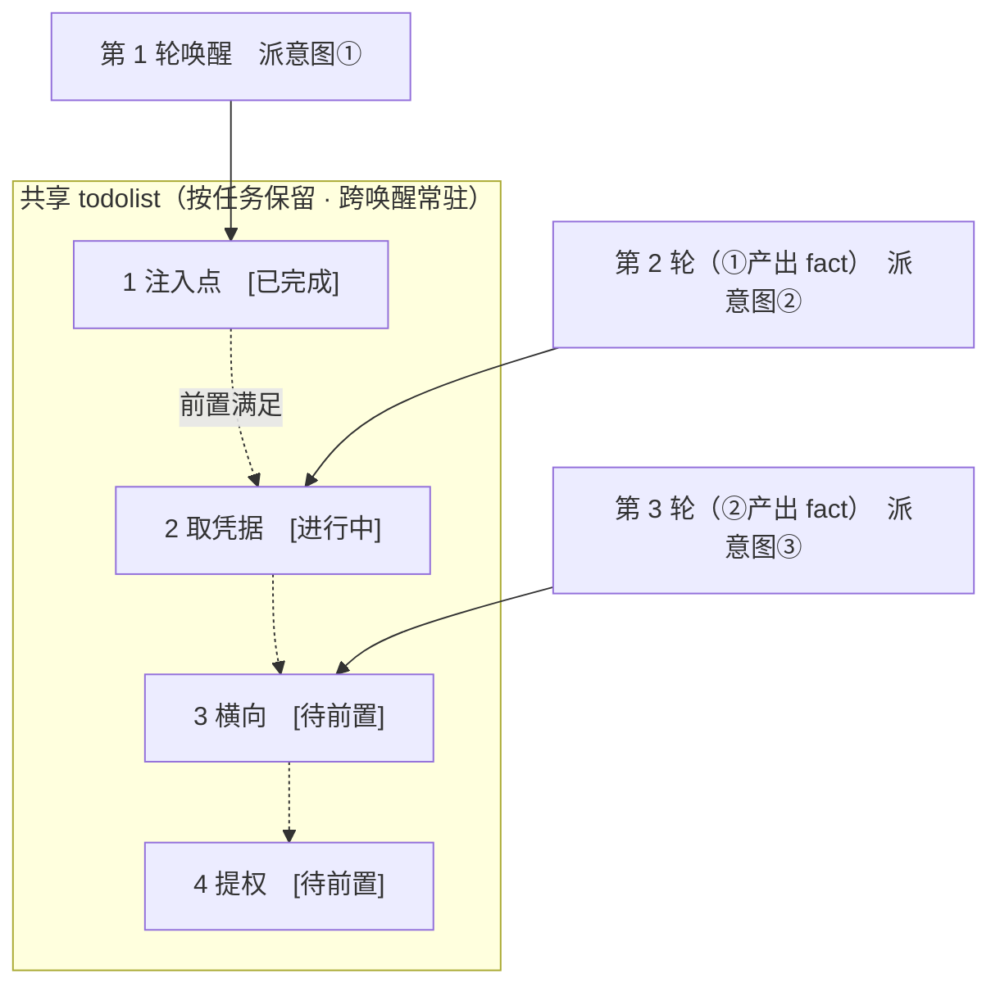

<div align="center">

# ARTEX

AI 자율 침투 테스트 시스템(Go 백엔드 + Next.js 프런트엔드)


🌐 **온라인 데모**: [https://artex-demo.vercel.app/](https://artex-demo.vercel.app/)

</div>

---

## 스크린샷 미리보기

> 전체 인터랙션은 [온라인 데모](https://artex-demo.vercel.app/)에서 확인하세요.

| 대시보드(개요 / Token 소비 / 활동 스트림) | 작업 목록 |
| :---: | :---: |
|  |  |

| 작업 · 실행 과정(세션 / 도구 호출) | 탐색 체인 |
| :---: | :---: |
|  |  |

| 발견 | 자산 |
| :---: | :---: |
|  |  |

| 자산 커버리지 맵(힘 기반 레이아웃 · 테스트 완료 하이라이트 · 노드 접기/펼치기) |
| :---: |
|  |

| 트래픽 기록 | 휴먼인더루프 대화 |
| :---: | :---: |
|  |  |

| Agent 관리 | LLM 설정 |
| :---: | :---: |
|  |  |

| 차단 승인(拦截审批) | 백엔드 로그 |
| :---: | :---: |
|  |  |


---

## 승인 기록 상세

전역「승인 기록(审批记录)」, 작업 내「차단 승인(拦截审批)」, 대화 속 승인 카드 모두 펼쳐서 상세를 볼 수 있습니다. 표시 구조는
[AegisHook의 승인 상세 컴포넌트](https://github.com/RuoJi6/AegisHook/blob/main/web/src/components/CallDetail.vue)를 참고했으며, ARTEX의 컴포넌트와 테마를 그대로 사용합니다:


## 자산 동기화(ScopeSentry)

[ScopeSentry](https://github.com/Autumn-27/ScopeSentry)에서 자산 데이터를 직접 동기화해 중복 수집을 없앨 수 있습니다:

- 「**자산 동기화(资产同步)**」페이지에서 ScopeSentry 주소와 API Key를 입력해 데이터 소스를 연결합니다;
- **프로젝트** 또는 **작업** 단위로 동기화할 대상과 자산 유형(도메인 / 서브도메인 / IP / 포트 / 사이트 / 엔드포인트…)을 선택합니다;
- 원클릭으로 가져와 회사 자산 범위 기준으로 병합하며, 곧바로 ARTEX의 자산 그래프에 들어가 agent 탐색에 사용됩니다.

---

## 설치

> 데이터베이스 **PostgreSQL**이 필요하고, 탐색에는 **LLM** 설정이 필요합니다(`ANTHROPIC_API_KEY` 또는 `OPENAI_API_KEY`, UI에서 설정할 수도 있음).

### 방식 1: 원클릭 설치 스크립트(권장)

```bash
git clone https://github.com/Autumn-27/ARTEX.git
cd ARTEX
./install.sh
```

스크립트는 Docker 감지 / 자동 설치 → **① 전부 Docker** 또는 **② 로컬 빌드 실행** 중 선택으로 진행됩니다:

- **① 전부 Docker**: Postgres 비밀번호를 하나 입력(엔터 시 랜덤 생성) → `.env` 자동 작성 → `docker compose up -d`.
- **② 로컬 실행**: 데이터베이스 선택(기존 DB 연결 / Docker로 새로 기동) → `config.json` 생성 → `go`로 내장형 단일 바이너리 컴파일 → 시작.

설치 후 **http://localhost:8787** 을 엽니다(최초 진입 시 `/setup`에서 관리자 비밀번호 설정).

### 방식 2: Docker Compose(수동)

```bash
git clone https://github.com/Autumn-27/ARTEX.git
cd ARTEX
cp .env.example .env          # 填 POSTGRES_PASSWORD、可选 ANTHROPIC_API_KEY
docker compose up -d          # 拉取 autumn27/artex 镜像 + postgres
# → http://localhost:8787
```

이미지에는 자주 쓰는 도구(ripgrep/curl/vim/npm/nmap…)가 이미 포함되어 있으며, `./skills`와 `./data`는 바인드 마운트로 영속화됩니다.

원격 MCP는 시스템 설정에서 `http`(Streamable HTTP) 또는 `sse`(구버전 SSE)를 선택할 수 있습니다.
구버전 SSE 서비스는 보통 `GET /sse`로 이벤트 스트림을 맺은 뒤, 서비스가 반환하는
`/message?sessionId=...`로 JSON-RPC 요청을 받습니다. 설정할 때는 URL을 `/sse`로, 요청 헤더는
`Authorization=Bearer <token>`으로 입력합니다.

### 방식 3: 프리컴파일 바이너리 다운로드(Releases)

[Releases](https://github.com/Autumn-27/ARTEX/releases)에서 플랫폼에 맞는 zip을 내려받아 압축을 풀면 `artex` + `start.sh`(Windows는 `start.bat`) + `skills/` + `config.example.json`을 얻습니다:

```bash
cp config.example.json config.json   # 填好 database 连接
./start.sh                           # → http://localhost:8787
```

> `./artex`를 직접 실행하지 말고 반드시 `start.sh` / `start.bat`으로 시작하세요. 이것은 수호(데몬) 스크립트로, 프로그램이 종료하면 종료 코드에 따라 재기동 여부를 결정하며 **페이지의 [원클릭 업데이트](#방식-1-페이지-원클릭-업데이트권장)가 교체(换装)를 완료하는 것도 이 스크립트에 의존합니다**. `./artex`를 직접 실행하면 업데이트가 끝난 뒤 다시 띄워지지 않습니다.
> 백그라운드 상주: `nohup ./start.sh >artex.log 2>&1 &`.

### 방식 4: 소스에서 단일 바이너리 컴파일

```bash
# 1) 前端静态导出
cd web && npm ci && npm run build:static && cd ..
# 2) 拷进内嵌目录
cp -r web/out server/webui/dist
# 3) 编译（-tags embedui 才内嵌前端）
CGO_ENABLED=0 go build -tags embedui -o artex ./cmd/artex
./start.sh
```

### 방식 5: 크로스 플랫폼 Release 압축 패키지 빌드

`build.sh`는 먼저 프런트엔드를 빌드해 내장한 뒤 Go linker로 디버그 정보를 제거하고, 릴리스 파일을 zip으로 압축합니다. Release 모드는 기본적으로 Linux amd64/arm64, macOS amd64/arm64, Windows amd64용 zip을 생성합니다:

```bash
./build.sh --release
# 产物：dist/artex-0.3.3-*.zip
```

UPX 셀프 압축 바이너리는 일부 Linux 커널, 가상화 환경 또는 보안 정책과 호환되지 않을 수 있으므로 기본적으로 활성화하지 않습니다. `ARTEX_TARGETS`로 대상을 직접 지정할 수 있고, 대상 실행 환경과의 호환이 확인되면 `--upx`를 명시적으로 넘겨 바이너리를 더 줄일 수 있습니다:

```bash
ARTEX_TARGETS=linux/amd64,windows/amd64 ./build.sh --release
./build.sh --target linux/amd64 --upx
```

---

## 업데이트 및 업그레이드

> 업그레이드는 프로그램만 교체하고 데이터는 건드리지 않습니다: Postgres 데이터 볼륨 `pgdata`, `./data`(jwt.key / SQLite 등), `./skills`는 모두 보존됩니다. **데이터베이스 마이그레이션은 수동 실행이 필요 없습니다** — `artex`는 시작할 때마다 `schema.sql`을 멱등하게 재실행(`ADD COLUMN` / `CREATE INDEX IF NOT EXISTS` 포함)하며, 이른바 "재시작이 곧 마이그레이션"입니다. 그래도 업그레이드 전에는 `./data`와 데이터베이스를 먼저 백업해 두기를 권장합니다.

### 방식 1: 페이지 원클릭 업데이트(권장)

**시스템 설정(系统配置)** 페이지(사이드바「시스템 설정」→ `/system/settings`)의 **버전 및 업데이트** 카드에서 서버에 로그인하지 않고도 새 버전을 확인하고 설치할 수 있습니다.

「업데이트」를 누르면: 현재 플랫폼의 릴리스 패키지 다운로드 → Release의 `SHA256SUMS` 대조 → `-h`로 새 바이너리 스모크 테스트 → `artex.new`로 스테이징 → 프로그램 종료 후 `start.sh` / `start.bat`이 재기동하며 교체를 완료합니다. 페이지는 새 버전이 올라올 때까지 기다렸다가 자동으로 새로고침됩니다.

- **실패해도 불량 프로그램이 남지 않습니다**: 검증이나 스모크 테스트를 통과하지 못하면 스테이징 파일을 폐기하고 현재 버전을 계속 실행합니다. 교체된 새 버전이 3회 연속 기동에 실패하면 `artex.old`로 자동 롤백합니다(실패한 바이너리는 `artex.failed`로 남아 원인 파악에 쓰입니다).
- **언제든 롤백 가능**: 이전 버전은 `artex.old`로 보존되며 카드에「이전 버전으로 롤백(回滚到上一版本)」이 있습니다. 단, 데이터베이스 구조는 롤백되지 않습니다.
- **업데이트는 실행 중인 작업을 중단시킵니다** — 업데이트는 곧 재시작이므로 한가할 때 진행하세요.
- **개발 빌드는 업데이트 대상이 아닙니다**: 버전이 `dev`이거나 `git describe` 결과에 접미사가 붙어 있으면 비활성화되어, 정식 버전이 로컬 디버그용 바이너리를 덮어쓰지 않도록 합니다.
- **Docker에서는 프로그램만 교체하고 이미지는 그대로입니다**: 이미지 속 playwright / nmap 등 툴체인은 함께 업그레이드되지 않으며, `docker compose up -d`로 컨테이너를 재생성하면 이미지 기본 버전으로 되돌아갑니다. 이미지까지 함께 올리려면 계속 `docker compose pull artex && docker compose up -d artex`를 사용하세요.
- GitHub 접근에 프록시가 필요하면 같은 페이지에서 **전역 프록시(全局代理)**를 설정하면 되고, 업데이트 경로가 이를 사용합니다. 업데이트는 GitHub 도메인에서만 다운로드하며 HTTPS를 강제합니다.

### 방식 2: 원클릭 업데이트 스크립트

```bash
cd ARTEX
./update.sh
```

스크립트는 먼저 선택적으로 `git pull`로 최신 코드를 받아온 뒤, **① Docker 업데이트** 또는 **② 로컬 빌드 업데이트** 중 선택하게 합니다(`install.sh`에 대응):

- **① Docker**: 대상 이미지 tag을 지정할 수 있고(엔터 시 `.env`의 `ARTEX_TAG` 사용, 기본값 `latest`) → `docker compose pull` → `docker compose up -d`(새 이미지로 재시작하면 자동 마이그레이션).
- **② 로컬**: 프런트엔드 정적 산출물을 재빌드 → `./artex`를 재컴파일(완료 후 프로세스 재시작으로 적용).

### 방식 3: Docker Compose(수동)

```bash
cd ARTEX
git pull                       # 更新 compose / 脚本（可选）
# 指定版本：在 .env 设 ARTEX_TAG=v0.2.0；不设则用 latest
docker compose pull artex
docker compose up -d artex     # 换新镜像重启 → 自动迁移 schema
docker image prune -f          # 清理旧镜像（可选）
```

### 방식 4: 프리컴파일 바이너리(Releases)

[Releases](https://github.com/Autumn-27/ARTEX/releases)에서 새 버전 zip을 내려받고, 기존 프로세스를 정지한 뒤 `artex`와 `skills/`를 덮어쓰고(`config.json`과 `data/`는 보존), 재시작하면 됩니다:

```bash
cp -r <解压目录>/skills ./ && cp <解压目录>/artex ./
./start.sh
```

### 방식 5: 소스에서 컴파일

```bash
git pull
cd web && npm ci && npm run build:static && cd ..
cp -r web/out server/webui/dist
CGO_ENABLED=0 go build -tags embedui -o artex ./cmd/artex
# 重启 ./start.sh
```

---

## 설정

**데이터베이스**(`config.json`, 또는 환경 변수 `ARTEX_PG_DSN`으로 오버라이드):

```json
{
  "database": {
    "host": "127.0.0.1", "port": 5432,
    "user": "artex", "password": "yourpass",
    "dbname": "artex", "sslmode": "disable"
  }
}
```

**LLM**: `export ANTHROPIC_API_KEY=sk-...`(또는 `OPENAI_API_KEY`), UI의「LLM 설정(LLM 配置)」페이지에서 입력할 수도 있습니다.
선택 사항: `ARTEX_LLM_PROVIDER` / `ARTEX_LLM_MODEL` / `ARTEX_LLM_BASE_URL` / `ARTEX_LLM_PROXY`.

**동시성**: 작업별 work agent 수는「시스템 설정(系统设置)」에서 구성합니다(기본 3).

**주요 파라미터**: `./start.sh -addr :8787 -proxy :8788`(`-addr`은 프런트엔드+API, `-proxy`는 트래픽 기록 프록시). 시작 스크립트는 파라미터를 그대로 `artex`에 전달합니다.

---


## 개발

### 수동 취약점 재검증(复测)

작업 상세의「재검증(复测)」탭에서 이 작업의 취약점을 페이지 단위로 선택하고, 지금까지의 판정과 증거를 보며 수동으로 재검증을 시작할 수 있습니다. 시작 후 현재 탭이 유지되고 스피너 아이콘과「재검증 중(复测中)」이 표시됩니다. 수정 확인 후에는 취약점 상태가 함께 갱신됩니다.

취약점 목록 각 행의 작업 영역에서「재검증」을 클릭하거나, 취약점 상세의「취약점 재검증(漏洞复测)」영역에서「재검증 시작(发起复测)」을 클릭해 선택 입력 항목인 수정 버전·테스트 조건·제한을 채우면, 시스템이 독립된 재검증 Agent 세션을 만들고 현재 페이지를 유지합니다. 목록의 플랫 보기, 작업별 그룹 보기, 자산 보기 모두 이 진입점을 지원합니다. 재검증이 실행 중이면 스피너 아이콘과「재검증 중」이 표시되고, 확인이 필요하면 클릭해 해당 세션으로 들어가며, 종료 후에는「재검증」으로 돌아옵니다. 재검증은 원본 스캔 작업을 다시 시작할 필요가 없으며, 판정은「여전히 재현됨(仍可复现)」「수정됨(已修复)」「확인 불가(无法确认)」로 나뉘고 매 회의 판정·증거·세션 링크가 취약점 상세에 저장됩니다.

새 버전 백엔드가 처음 시작할 때 편집 가능한「취약점 재검증(漏洞复测)」(`retester`) Agent를 미리 만들며, Agent 관리에서 프롬프트, LLM, 실행 예산, 도구를 설정할 수 있습니다. 기본적으로 자기에 바인딩된 LLM을 사용하고, 바인딩이 없으면 전역 활성 설정을 사용합니다. 재검증 세션이 성공적으로 완료되고 판정이「수정됨」이면 시스템이 취약점 처리 상태를 자동으로「수정됨」으로 바꿉니다. 실행 중·실패·중지 또는 다른 판정에서는 원래 상태가 유지됩니다. 원본 증거와 보고서는 항상 보존됩니다. 상태 드롭다운에서 직접「수정됨」을 선택할 수도 있습니다. 같은 취약점의 재검증이 진행 중일 때는 기존 세션을 재사용하며, 중지·실패 또는 서비스 재시작 후에는 다시 시작할 수 있습니다.

이 버전의 이력 기록은 취약점 상세와 세션을 통해 조회하며, 아직 취약점 보고서 내보내기나 작업 아카이브 패키지에는 포함되지 않고, 트래픽 캡처와 자동 연결되지도 않습니다. 데모 모드는 명확히 표시된 모의 기록만 생성하며 실제 대상에 요청을 보내지 않습니다.

### 로컬 실행과 테스트

```bash
./dev.sh    # 后端(:8787) + 流量代理(:8788) + 前端 next dev(:5173) → http://localhost:5173
```

- 백엔드: `go run ./cmd/artex`(`-tags embedui` 없이 실행하면 프런트엔드를 내장하지 않음)
- 프런트엔드: `cd web && npm run dev`(`/api`를 백엔드로 리버스 프록시, 핫 리로드 지원)
- 테스트: `go test ./...`
- Mock 미리보기(백엔드 없음): `cd web && NEXT_PUBLIC_MOCK=1 npm run dev`

---

## 시스템 기술 아키텍처

ARTEX는 **LLM 멀티 agent 기반 자율 침투 시스템**입니다: Go 모놀리식 백엔드(Next.js 프런트엔드 내장) + PostgreSQL이며, agent 능력은 [`norma`](https://github.com/Autumn-27/norma) SDK(`agentcore` / `tool` / `permission` / `harness` / `memory` / `transcript`)가 제공합니다. 핵심은 **이중 그래프 아키텍처(双图架构)**이고, 이를 둘러싼 두 가지 자율성 메커니즘이 **worker 간 프로세스 수준 정보 교환**과 **planner 다중 라운드 공유 todolist 기반 안정적 공격 체인**입니다.

### 전체 계층



| 계층 | 책임 |
| --- | --- |
| **프런트엔드** | Next.js 정적 export, `go:embed`로 단일 바이너리에 내장. 작업/자산/탐색 체인/커버리지 맵 시각화, 휴먼인더루프 대화 |
| **server** | `net/http` 라우팅 + JWT 인증 + SSE. `Manager`가 작업·엔진·DB store의 라이프사이클을 관리 |
| **engine** | 작업별 `plannerLoop` 1개 + worker goroutine N개. 의도 인출, 타임아웃/일시정지/drain |
| **agent** | goals / planner / worker / mainagent. `ToolSet`이 이중 그래프를 LLM 도구로 노출 |
| **db** | 이중 그래프의 Postgres 구현(pgx). 스키마는 `go:embed`로 매 시작 시 멱등하게 테이블 생성 |
| **지원** | 기록형 MITM 프록시, 승인 게이트, 비동기 보완, MCP/스킬/메모리/리포트 |

### 이중 그래프 아키텍처: 탐색 그래프 + 자산 그래프

시스템은「**무엇이 목표인가**」와「**어디까지 테스트했는가**」를 서로 독립적이면서 앵커로 연결된 두 그래프로 분리합니다:

- **자산 그래프(Asset Graph, 전역 공유)**: 작업과 무관하게 동일한 자산 진값(truth) 저장소. 노드는 `root_domain / subdomain / ip / service / app / endpoint`이며 회사에 귀속됩니다. 도메인→서브도메인→서비스→엔드포인트의 부모-자식 관계와 중복 제거 key는 모두 프로그램이 계산하고, agent는 원시 정보만 제출합니다.
- **탐색 그래프(Exploration Graph, 작업별 독립)**: 한 작업의 "생각과 진행" 과정. 노드는 `goal(목표) / intent(의도) / fact(사실) / finding(취약점) / hint(힌트)`이며 `spawns / derived_from / yields / proves` 등의 엣지로 **혈연 체인(lineage)**을 이루어, "어떤 방향이 어떤 사실에서 파생되었고 무엇을 산출했는가"에 답합니다.
- **두 그래프는 앵커로 연결**: `exploration_anchors(node_id, asset_id)`가 의도/사실/취약점을 구체적 자산에 고정합니다 — 그래서 "탐색 방향"에서 어느 자산을 공략했는지 볼 수도 있고, "특정 자산"에서 이 작업에서 어떤 의도로 테스트되었고 어떤 사실이 도출되었는지 역으로 조회할 수도 있습니다. 이것이 **자산 테스트 커버리지**와 **자산 커버리지 맵**(범위 내 자산 + 테스트 완료 하이라이트)을 뒷받침합니다.



> 역할 분담: **planner**는 탐색 그래프의 상황을 읽고 목표를 판정하며, 커버되지 않은 새 방향이 있을 때만 **의도**를 frontier에 넣습니다. **worker**는 **의도 하나**를 인출해 실제 도구로 실행하고, 새 자산/사실/취약점을 두 그래프에 기록한 뒤 바로 멈춥니다. 자산 그래프는 공유 사실이고, 탐색 그래프는 작업별 진행 체인입니다.

### 엔진과 의도 라이프사이클(한 번 탐색의 폐루프)

엔진은 **이벤트 드리븐** 폐루프입니다: 그래프가 변하면 곧바로 planner가 깨어나 의도를 내보내고, worker는 의도를 인출해 실행·기록하며, 기록이 다시 다음 라운드를 트리거합니다 — 목표가 입증(`prove_goal`)될 때까지.



### worker 간 프로세스 수준 정보 교환

깊이 있는 탐색에서 가치 있는 관찰(어떤 에러, 어떤 응답, 어떤 숨은 파라미터)의 상당수는 한 worker의 **실행 과정** 속에만 나타나고 정식 fact로 기록되지 않을 수 있습니다. 중복 노동을 피하고 체인 위의 worker들이 서로의 어깨 위에 설 수 있도록, worker는 **work 경계를 넘어 실행 과정을 검색**하는 능력을 갖습니다:

- `search_all_worker_traces(q)`: **이 작업의 다른 work 실행 과정**에서 키워드로 검색합니다(자기 의도의 스텝은 자동 제외), 히트 항목에는 `intent_id`가 붙습니다;
- `list_worker_traces` / `get_worker_trace(intent_id, step_ids=[…])`: 먼저 어떤 work가 실행되었는지 보고, 특정 work의 특정 스텝 전체 내용을 가져와 세부 교환을 합니다.

이렇게 하면 탐색 그래프에 아직 대응하는 fact가 없어도 이후 worker가 다른 worker 과정 속 관찰을 재사용할 수 있습니다 — **정보가 worker 사이를 "실행 과정" 단위로 흐르되**, 경계는 그대로입니다(각 worker는 여전히 자신이 인출한 의도만 수행).



### planner 다중 라운드 공유 todolist → 안정적인 공격 체인

실제 공격 체인은 대개 **앞뒤 의존이 있는 다단계 시퀀스**(예: 인젝션 지점 발견 → 자격 증명 획득 → 측면 이동 → 권한 상승)이며, 이를 한꺼번에 병렬로 내보내면 엉키기만 합니다. 그래서 planner는 **작업별로 유지되고 깨어날 때마다 공유되는 계획 투두리스트(todolist)**를 갖습니다:

- planner는 이벤트 드리븐입니다 — 그래프가 변하면 깨어나지만 **깨어날 때마다 완전히 새로운 세션**입니다. 공유 todolist 덕분에 직렬 exploit 체인을 **한 번만 기록**해 두고 이후 라운드에서 **의존에 따라 단계적으로 의도를 내보낼** 수 있으며, 체인 전체를 한 라운드에 미리 펼치지 않습니다;
- 매 라운드는「선행 스텝이 완료되고 의존하는 fact가 이미 존재하는」다음 스텝에만 의도를 내보내고, 진행에 따라 목록을 갱신합니다(fact로 충족된 스텝을 완료 표시).



이렇게 하면 공격 체인은 "이벤트 드리븐 + 무상태 세션" 환경에서도 **안정적으로 진행되고, 중복 없이, 순서가 어긋나지 않습니다** — ARTEX가 다단계 exploit 체인을 자율로 완주할 수 있는 핵심입니다.

---

## 커뮤니티

QR 코드를 스캔해 위챗 공식 계정(微信公众号) **SecSentry**를 팔로우하고, 공식 계정으로 쪽지를 보내면 그룹에 들어와 교류할 수 있습니다.

<div align="center">


</div>

---
## 참고

https://github.com/oritera/Cairn


## 라이선스 및 면책 조항

### 오픈소스 라이선스

이 프로젝트는 **GNU Affero General Public License v3.0(AGPL-3.0)**으로 라이선스되며, 전체 조문은 저장소 루트의 [LICENSE](../LICENSE) 파일에 있습니다.

즉 누구나 이 프로젝트를 자유롭게 사용·수정·배포할 수 있지만 **파생 저작물도 동일하게 AGPL-3.0으로 오픈소스화해야 합니다**. 특히 **이 프로젝트를 수정해 네트워크를 통해(예: 온라인 서비스로 배포) 사용자에게 제공하는 경우, 해당 사용자에게도 상응하는 전체 소스 코드를 공개해야 합니다**.

> ⚠️ **중요 안내**: 오픈소스 라이선스 자체는 소프트웨어의 사용 용도를 제한하지 않습니다. 아래의「사용 제한」과「면책 조항」은 저자가 사용자에게 부과하는 추가 약속이자 정중한 성명이므로 반드시 지켜 주십시오.

**ARTEX는 개인 학습, 코드 연구, 로컬 기술 검증 목적으로만 사용할 수 있으며, 온라인 시스템이나 웹사이트에 실제 테스트를 수행하는 데 사용할 수 없습니다.**

### 허용되는 사용 범위

- **본 프로젝트 소스 코드의 열람·학습·연구**와 **로컬 격리 환경**에서의 기술 원리 검증에만 사용할 수 있습니다;
- 개인 학습, 학술 연구, 코드 리뷰 등 비공격적 용도에 적용됩니다.

### 금지 사항

- **본 도구로 어떤 웹사이트·온라인 서비스·네트워크 시스템에도 스캔·탐지·익스플로잇·공격을 시도하는 것을 엄격히 금지합니다**(권한을 받았는지, 자기 자산인지와 무관);
- 본 도구를 실제 침투 테스트, 공방 대항 또는 프로덕션 환경에 사용하는 것을 엄격히 금지합니다;
- 본 도구를 불법 침입, 데이터 절취, 랜섬, 서비스 거부 또는 그 밖의 파괴적·범죄적 활동에 사용하는 것을 엄격히 금지합니다;
- 소재 국가/지역의 법률·규정을 위반하는 행위에 본 도구를 이용하는 것을 엄격히 금지합니다.

### 컴플라이언스 책임

사용자는 소재 국가/지역의 네트워크 보안, 데이터 보호, 컴퓨터 범죄 관련 법률·규정 전부를 스스로 준수해야 합니다(중국 대륙에서는「사이버보안법(网络安全法)」「데이터보안법(数据安全法)」「개인정보보호법(个人信息保护法)」및 관련 사법해석을 포함하되 이에 국한되지 않음). **본 도구의 사용으로 발생하는 모든 법적 책임과 결과는 사용자가 부담합니다.**

### 면책 조항

이 프로젝트는 "있는 그대로(AS IS)" 제공되며, 명시적이든 묵시적이든 어떠한 보증도 따르지 않습니다. 저자와 기여자는 본 도구의 사용(사용 방식의 적절 여부와 무관)으로 인한 직접·간접 손실, 데이터 유실, 시스템 손상 또는 법적 분쟁에 대해 책임지지 않습니다. **본 프로젝트를 다운로드, 설치 또는 사용하는 것은 위 전체 조항을 읽고 이해했으며 동의했음을 의미합니다.**
