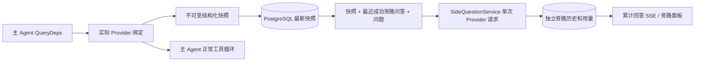

# ARTEX `/btw`

일반 대화, 작업 MainAgent, 그리고 현재 작업 자신의 Worker는 독립적인 사이드 질문(旁路提问)을 지원한다. 메인 입력창에 `/btw 问题`(질문)을 입력하면 제출되고, 빈 `/btw` 또는 「사이드 질문(旁路提问)」 버튼으로 히스토리를 연다. 데스크톱에서는 폭을 조절할 수 있는 사이드바를, 모바일에서는 Drawer를 사용한다.

사이드 답변은 제출 시점의 Agent 컨텍스트 스냅샷을 기반으로 생성되며, 스트리밍 표시, 후속 질문, 중지, 비우기를 지원한다. 패널을 닫거나 페이지를 새로고침하거나 SSE가 끊겨도 모델 요청은 취소되지 않는다. 중지는 현재 사이드 질문에만 영향을 준다. 비우기는 사이드 질문을 취소하고 사이드 히스토리를 삭제하되, 메인 컨텍스트 스냅샷은 유지한다.

## 구현 경계

Go, norma v0.3.7, Next.js, 기존 Markdown / ResizablePanel / Drawer / AlertDialog 컴포넌트를 그대로 사용한다. norma 소스를 수정하지 않았고 사이드 질문을 위해 의존성을 추가하지도 않았다. Planner, 다른 작업에서 상속된 Worker, 도구형 하위 작업의 승격은 이번 범위에 없다.

- `capture.go`는 `Options.Deps.CallModel / CallModelSync`에서 메인 루프 요청에만 표시를 남긴다. Provider 데코레이터는 구체 모델 내부, 라우팅 풀 외곽 선택 이후에 위치하므로 실제 선택된 모델을 기록한다. 압축과 요약 요청은 스냅샷을 덮지 않는다.
- 요청 시작, 완전한 모델 응답, 실행 종료 상태에서 스냅샷을 발행한다. 생성 중인 반쪽 응답은 발행하지 않는다. 도구 호출은 norma의 `MessagesForAPI`로 쌍을 유지하며, 도구 결과는 다음 메인 모델 요청 또는 실행 종료 상태에서 스냅샷에 들어간다. 스트리밍 중단 시에는 마지막 유효 경계를 유지한다.
- 스냅샷은 JSON 딥 카피로 구조화된 메시지, 시스템 프롬프트, 도구 정의, 생성 파라미터를 보존한다. 모델 추론은 스냅샷 잠금이나 DB 트랜잭션을 점유하지 않는다.
- `SideQuestionService`는 구체 Provider를 호출한다. 필요하면 먼저 사이드 요약을 생성하고, 최종 답변은 첫 컨텍스트 초과이면서 아직 텍스트/도구 호출을 출력하지 않은 경우에 한해 축소 후 한 번 재시도할 수 있다. agent 세션을 만들지 않고, 도구 실행기, 메인 transcript, 활동 스트림, 작업 그래프에 붙지도 않으며, 작업 모델 전환 체인을 거치지도 않는다. 답변에 도구 정의를 유지하는 것은 기존 구조화 도구 컨텍스트와의 호환 때문이다. 요약 요청에는 도구를 제공하지 않는다. 새로 반환된 도구 호출에는 실행 경로가 없다.
- 부모 세션 하나당 실행 요청 하나, 단일 서비스 프로세스 기준 최대 4개, 단회 요청 타임아웃은 120초다. 사이드 질문은 서비스 수명주기 아래의 독립 취소 컨텍스트를 사용한다.
- 사이드 요청은 모델 설정 참조와 비민감 신원 요약을 유지하며, 요청 시점에 기존 설정에서 자격증명을 가져온다. 설정이 삭제되었거나 모델, 프로토콜, 주소 등 신원 필드가 바뀌면 먼저 메인 Agent를 실행해 스냅샷을 갱신해야 한다. 테스트는 제품 기본 모델을 바꾸지 않는다.

## 영속화와 복구

`db/schema.sql`이 `side_question_sessions`과 `side_question_requests`를 자동 생성한다. 전자는 부모 리소스, 최신 스냅샷, 실행 번호, 버전, 정리 버전을 저장하고, 후자는 질문, 누적 답변, 상태, 모델, 스냅샷 시각, 사용량, 이벤트 서수, 페이지네이션 서수를 저장한다.

부모 세션 키는 conversation ID 또는 task ID + exploration ID + intent ID다. Worker는 재사용 가능한 실행 슬롯 명명을 사용하지 않는다.

스냅샷은 부모 세션 기준으로 병합 기록되며 250ms마다 한 번 flush되고, DB는 `(run_id, version)` 비교로 구버전이 덮어쓰는 것을 막는다. 사이드 제출 전에 선택된 스냅샷을 다시 저장한다. 저장 성공 후 메모리의 대형 스냅샷을 해제하고, 실패 시에는 기록 대기 버전을 유지한다. 답변 누적 내용은 스트리밍 이벤트가 올 때 최대 250ms 간격으로 기록하고, 종료 상태는 즉시 저장하며 DB 오류 시 제한적으로 재시도한다.

서비스 시작 시 남아 있는 `running` 요청을 `interrupted`로 표시한다. 이미 DB에 반영된 부분 답변과 사용량은 유지하되 요청을 자동 재생하지는 않는다. 마지막으로 성공 저장한 컨텍스트는 다음 질문에 바로 쓸 수 있다. 구(舊) 세션에 스냅샷이 없으면 먼저 메인 Agent를 실행하도록 요구하며, UI 활동 기록으로 컨텍스트를 재구성하지 않는다.

비우기는 정리 버전을 올리고 요청을 삭제한다. 조건부 갱신이 늦게 도착한 콜백의 재기록을 막는다. 물리적 부모 리소스 삭제는 외래 키 연쇄에 맡기고, Worker 논리 삭제는 같은 트랜잭션에서 사이드 데이터를 삭제하며 이후의 늦은 스냅샷을 거부한다. 작업 아카이브는 먼저 새 요청을 막고, 메인 흐름 정지를 기다리고, 사이드 질문을 취소한 뒤 DB 반영까지 기다린다. 아카이브 형식은 v3이며 사이드 테이블이 없는 v1/v2도 호환한다.

히스토리는 완전하게 저장되고, 서수 커서 기준 페이지당 최대 20건을 반환한다. 모델 요청은 최근 20조의 성공한 질의응답 원문까지만 재생하며, 동시에 token 예산으로 재생량을 제한한다. 더 오래된 질의응답은 별도의 롤링 요약으로 관리한다. 메인 컨텍스트가 예산을 초과하면 사이드 사본의 구(舊) 부분만 요약하고, 최근의 구조화 도구 호출과 결과는 유지한다. 요약, 준비 진행, 사용량은 함께 사이드 질문의 동시성, 취소, 120초 타임아웃 제약에 포함된다. 자세한 내용은 [컨텍스트 예산과 오픈소스 참고(上下文预算与开源参考)](CONTEXT_BUDGET.md)를 참조한다.

## HTTP 계약

다음 경로를 `{parent}`로 사용하며, 기존 인증과 리소스 검증을 따른다:

- `/api/conversations/{id}`
- `/api/tasks/{id}/chat`
- `/api/tasks/{id}/intents/{iid}`

| 요청 | 반환 및 동작 |
| --- | --- |
| `GET {parent}/side-questions?before={ordinal}` | `items`는 신규→구(舊) 순, 독립 `current` 실행 상태, `snapshot` 메타정보, `next_cursor`; 커서가 0이면 최신 페이지 / 다음 페이지 없음 |
| `POST {parent}/side-questions` | JSON `{ "question": "…", "client_request_id": "UUID" }`; 신규 요청은 202와 요청 객체, 같은 ID와 질문이면 기존 객체를 200으로 |
| `DELETE {parent}/side-questions` | 현재 부모 세션의 사이드 질의응답을 취소하고 비운다 |
| `GET /api/side-questions/{requestID}/events` | `snapshot` SSE 이벤트, `id`는 증가 서수, `data`는 완전한 누적 요청 객체; 비움 시 `cleared` 전송 |
| `POST /api/side-questions/{requestID}/cancel` | 명시적 취소; 종료 상태는 히스토리 또는 SSE에서 읽을 수 있다 |

질문 상한은 4000자다. 스냅샷 없음, 모델 설정 변경, 같은 부모 세션 사용 중, 멱등 ID 충돌은 409를 반환하고, 전역 동시성 상한은 429를 반환한다. SSE 연결은 매번 먼저 누적 상태를 전송하며, 클라이언트가 이전에 받은 텍스트 조각에 의존하지 않는다. 프런트엔드는 요청 ID + 서수로 병합하고, 부모 세션 전환·비우기 시 기존 콜백을 폐기한다.

## 검증과 참고

자동화 검사, 실제 모델 사용, 알려진 제한은 [VALIDATION.md](VALIDATION.md)를 참조한다.

독립 요청의 참고 구현은 [Grok CLI side-question.ts(고정 커밋)](https://github.com/superagent-ai/grok-cli/blob/fb97af83f06dca873281d60168430f06c8de6324/src/utils/side-question.ts)이고, 실행 격리의 참고 구현은 [OpenCode(고정 커밋)](https://github.com/anomalyco/opencode/tree/b3f1a96c6dd7adeb28b36dd11add1998fc84d67b)이다. ARTEX의 컨텍스트는 norma의 구조화 메시지를 사용하며, 프런트엔드 로그에서 텍스트를 이어 붙이는 방식은 채택하지 않았다.
